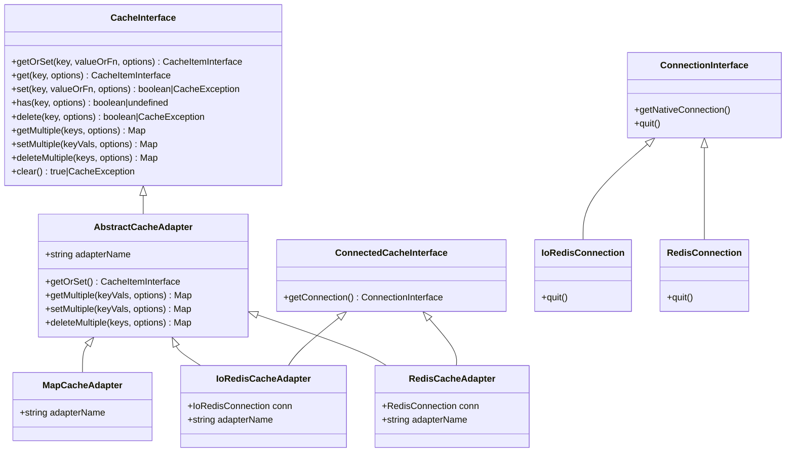

<div align="center">
  <h1 align="center"><a aria-label="soluble/cache-interop" href="https://github.com/soluble-io/cache-interop">cache-interop</a></h1>
  <p align="center">Interoperable cache adapters for node and browsers.</p>
</div>
<p align="center">
  <a aria-label="Build" href="https://github.com/soluble-io/cache-interop/actions?query=workflow%3ACI">
    
  </a>
  <a aria-label="Codecov" href="https://codecov.io/gh/soluble-io/cache-interop">
    
  </a>
  <a aria-label="Codefactor grade" href="https://www.codefactor.io/repository/github/soluble-io/cache-interop">
    
  </a>
  <a aria-label="CodeClimate maintainability" href="https://codeclimate.com/github/soluble-io/cache-interop">
    
  </a>
  <a aria-label="CodeClimate technical debt" href="https://codeclimate.com/github/soluble-io/cache-interop">
    
  </a>
  <a aria-label="Downloads" href="https://npm.im/@soluble/cache-interop">
    
  </a>
  <a aria-label="Ts LoC" href="https://github.com/soluble-io/cache-interop/search?l=typescript">  
    
  </a>
  <a aria-label="Licence" href="https://github.com/soluble-io/cache-interop/blob/main/LICENSE">
    
  </a>
</p>

# About | [Documentation](https://github.com/soluble-io/cache-interop/)

> **Warning** Before v1 is released expect breaking changes in API

## Features

- [x] Simple but powerful [API](./packages/cache-interop/src/cache.interface.ts).
- [x] Native promises /`async`/`await`.
- [x] Don't throw errors.
- [x] Typescript friendly.
- [x] High quality & covergae, see [e2e](packages/cache-e2e-tests/test/suites) tests.
- [x] Multiple adapters: node-redis, ioredis.

## Roadmap

- [ ] Finalize v1 API
  - [ ] injectable LoggerInterface
  - [ ] SerializerInterface (json, msgpack, gzip, marshaller, superjson)
    - [ ] Chainable serializer (json -> gzip...)
  - [ ] Cache manager
    - [ ] Chainable cache adapter (allows lru as L1, redis as L2)
- [ ] Adapters
  - [ ] lru-cache
- [ ] Documentation

## Adapters

| package                                            | targets          | description                                                              | Info                                                                         |
| -------------------------------------------------- | ---------------- | ------------------------------------------------------------------------ | ---------------------------------------------------------------------------- |
| [@soluble/cache-interop](./packages/cache-interop) | `node`,`browser` | Interoperability interfaces & contracts                                  |  |
| [@soluble/cache-ioredis](./packages/cache-ioredis) | `node`           | Adapter for [ioredis](https://github.com/luin/ioredis) driver            |  |
| [@soluble/cache-redis](./packages/cache-redis)     | `node`           | Adapter for [node-redis](https://github.com/NodeRedis/node-redis) driver |    |

## Utils

| package                                      | target           | description                 | Info                                                                      |
| -------------------------------------------- | ---------------- | --------------------------- | ------------------------------------------------------------------------- |
| [@soluble/dsn-parser](./packages/dsn-parser) | `node`,`browser` | Tiny and relaxed DSN parser |  |

### At a glance

```typescript
import { IoRedisCacheAdapter } from "@soluble/cache-ioredis";

const cache = new IoRedisCacheAdapter({
  connection: "redis://localhost:6375",
});

const getSomething = async () => JSON.stringify({ success: true });

const { data, error } = await cache.getOrSet(
  // Cache key
  "cacke-key-v-1",
  // Async function
  getSomething,
  // GetOrSetOptions
  { ttl: 3600 }
);

if (error instanceof Error) {
  throw error;
}

let parsed;
try {
  parsed = JSON.parse(data);
} catch (e) {
  throw new SerializerException(e.message);
}
```

## Diagram



## Options

| GetOrSetOptions | target                                      | default | description                                                   |
| --------------- | ------------------------------------------- | ------- | ------------------------------------------------------------- |
| `ttl`           | `number`                                    | 0       | Time-To-Live in seconds since Epoch time. If zero, no expiry. |
| `disableCache`  | `boolean`/`{read: boolean, write: boolean}` | false   | Disable cache                                                 |

## Structure

This monorepo holds the various adapters, the contracts for interoperability and the e2e tests.

```
./packages
 ├── dsn-parser
 │   └── # @soluble/dsn-parser: utility for parsing connection dsn #
 ├── cache-interop
 │   └── # @soluble/cache-interop: cache interoperability contracts #
 ├── cache-ioredis
 │   └── # @soluble/cache-ioredis: ioredis adapter implementation #
 ├── cache-redis
 │   └── # @soluble/cache-redis: node redis adapter implementation #
 └── cache-e2e-tests
     └── # e2e test suite for all adapters #
```

### Inspiration

- [PSR-6](https://www.php-fig.org/psr/psr-6/) - PHP Cache interface standard recommendation.
- [PSR-16](https://www.php-fig.org/psr/psr-6/) - PHP SimpleCache interface standard recommendation.
- [Symfony cache](https://github.com/symfony/cache) - Symfony cache component.
- [Node-cache-manager](https://github.com/BryanDonovan/node-cache-manager) - Flexible NodeJS cache module.
- [C# getOrSet](https://csharp.hotexamples.com/examples/Microsoft.Framework.Caching.Memory/MemoryCache/GetOrSet/php-memorycache-getorset-method-examples.html) - C# Memory::getOrSet() method.
- [SWR](https://swr.vercel.app/) - React Hooks library for data fetching

### Acknowledgements

- [microbundle](https://github.com/developit/microbundle) - Zero-configuration bundler for tiny modules.
- [node-testcontainers](https://github.com/testcontainers/testcontainers-node) - Ephemeral docker instances to facilitate e2e on various services (redis...)
- [atlassian/changesets](https://github.com/atlassian/changesets) - To ease pain with monorepo versioning.
